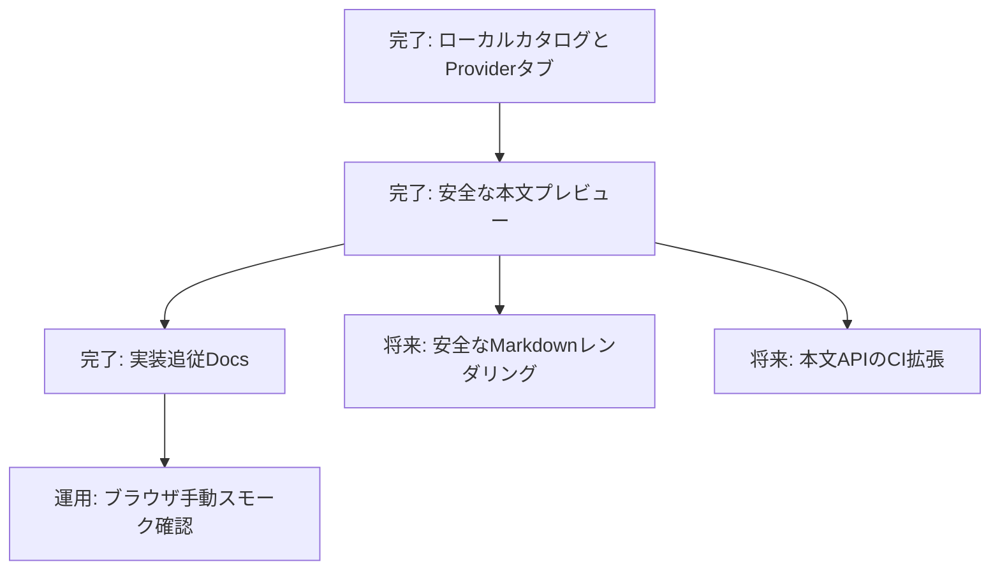

# 初期実装タスクフロー（アーカイブ）
## アーカイブ情報
PR #3からPR #6までで初期ローカルビューアの実装、CI、設計文書追従は完了した。本書は履歴として保持し、Browser E2E自動化などの後続作業は`ACV-FE-001_ローカルビューアブラウザE2E検証方針.md`で管理する。
| 項目     | 内容                        |
| :------- | :-------------------------- |
| 文書番号 | ACV-PM-001                  |
| 版数     | Rev.2.0（実装追従Docs更新） |
| 改訂日   | 2026-09-08                  |
## 1. 運用方針
Docs、CI、Srcは別タスク・別PRとする。Docs PRは`docs/`だけ、CI PRはworkflow・検証スクリプト・CI運用文書だけ、Src PRは一つの利用者価値を提供するコードだけを変更する。既存機能の仕様追従を目的とするDocs PRはSrc・CIを変更しない。
## 2. 完了済みタスク
| ID        | 区分 | 状態          | 成果                                                                      |
| :-------- | :--- | :------------ | :------------------------------------------------------------------------ |
| T-DOC-001 | Docs | 完了          | 初期設計、レビュー、タスクフロー、Mermaid運用文書                         |
| T-DOC-002 | Docs | 完了          | 初期Provider範囲とDTOの実装前設計確定                                     |
| T-CI-001  | CI   | 完了          | Docs内Mermaid構文を検証するGitHub Actions                                 |
| T-SRC-001 | Src  | 完了（PR #3） | `server.py`によるホーム固定カタログ、Kiro・Claude・Gemini・Codexタブ、CLI |
| T-CI-002  | CI   | 完了（PR #4） | Python構文、空HOME CLI、ES Module構文を検証するローカルビューアCI         |
| T-SRC-002 | Src  | 完了（PR #5） | 不透明File ID、本文API、2MiBガード、プレーンテキストプレビュー            |
| T-DOC-003 | Docs | 完了          | ローカルサーバー、本文API、状態モデル、CI運用への設計文書追従             |
## 3. 現行CI
| Workflow              | 対象                                               | 内容                                  |
| :-------------------- | :------------------------------------------------- | :------------------------------------ |
| Mermaid validation    | `docs/**/*.md`                                     | Mermaidブロックの構文レンダリング検証 |
| Validate local viewer | `server.py`、`cli.py`、`index.html`、`src/**/*.js` | Python構文、空HOME CLI、ES Module構文 |
Docsのみを変更する本タスクではMermaid validationを品質ゲートとする。ローカルビューアCIの詳細は`docs/setup/local_viewer_ci_validation.md`を正本とする。
## 4. 依存関係

## 5. 残タスク
| ID           | 区分 | 状態     | 内容・着手条件                                                                                         |
| :----------- | :--- | :------- | :----------------------------------------------------------------------------------------------------- |
| T-OPS-001    | 運用 | 未確認   | `py server.py`で起動し、実ブラウザで一覧・タブ・本文プレビューを確認する                               |
| T-SRC-003    | Src  | 未着手   | Markdown parserとDOMPurifyを固定版で導入し、安全なHTMLレンダリングを追加する。依存追加の明示承認が必要 |
| T-CI-003     | CI   | 未着手   | 本文APIの回帰検証をCIへ追加する。テスト範囲と実行方式を別途合意する                                    |
| T-FUTURE-001 | 将来 | 未要件化 | 検索、差分、編集、任意パス選択は安全境界を再設計してから扱う                                           |
## 6. 改訂履歴
| 版数    | 改訂日     | 変更者 | 変更内容・変更理由                                |
| :------ | :--------- | :----- | :------------------------------------------------ |
| Rev.1.0 | 2026-09-08 | xzyozi | 初版作成。                                        |
| Rev.1.1 | 2026-09-08 | xzyozi | 実装前設計を確定。                                |
| Rev.2.0 | 2026-09-08 | xzyozi | PR #3〜#5、現行CI、実装追従Docs、残タスクを反映。 |
