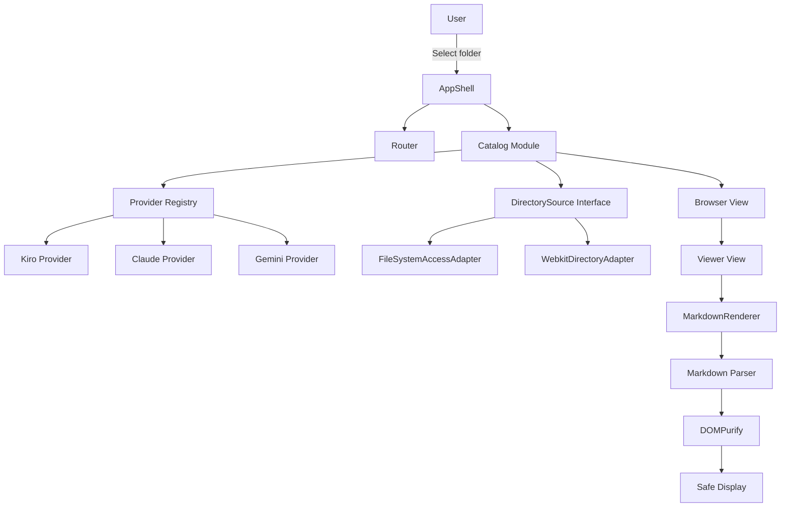

# 基本設計書（ローカルAIエージェント設定ビューア）
**agent-config-viewer：複数のエージェント設定を横断閲覧するローカル完結型Webアプリケーション**

| 項目           | 内容                           |
| :------------- | :----------------------------- |
| 文書番号       | ACV-BD-001                     |
| ドキュメント名 | agent-config-viewer 基本設計書 |
| 版数           | Rev.1.1（レビュー反映）        |
| 改訂日         | 2026-09-08                     |
| 作成日         | 2026-09-08                     |
| 作成者         | xzyozi                         |

## 1. 概要と基本方針
### 1.1 システム目的と対象範囲
agent-config-viewer は、ユーザーが明示的に選択したローカルフォルダ配下から `.kiro`、`.claude`、`.gemini` などのAIエージェント設定ディレクトリを検出し、対象ファイルを閲覧するビューアである。

対象は設定・ドキュメントの閲覧であり、編集、保存、外部サービス送信、認証連携、ディレクトリへの書き込みは初期スコープに含めない。

| 区分         | 内容                                                                                         |
| :----------- | :------------------------------------------------------------------------------------------- |
| 対象         | `.kiro`、`.claude`、`.gemini` 配下の設定・Markdown・スキル定義など                           |
| 主機能       | ルートフォルダ選択、対応エージェント検出、カテゴリ別一覧、ファイル表示、Markdownレンダリング |
| 非対象       | ファイル編集・保存、アップロード、同期、認証、クラウド接続                                   |
| 将来拡張     | 全文検索、差分表示、追加エージェント、閲覧履歴、設定エクスポート                             |
| リポジトリ名 | `agent-config-viewer`                                                                        |

### 1.2 アーキテクチャ基本原則
| 課題・制約                               | 解決方針                                                                             | 担当Module                    |
| :--------------------------------------- | :----------------------------------------------------------------------------------- | :---------------------------- |
| ローカル設定を外部へ出したくない         | ブラウザ内処理のみとし、通信・アップロード機能を実装しない                           | `DirectorySource`、`AppShell` |
| エージェントごとに構造が異なる           | エージェント固有のパス・カテゴリをProvider Moduleへ閉じ込める                        | `providers/`                  |
| Markdown表示でスクリプトが実行される危険 | 生HTMLを無効化して変換し、DOMPurifyで許可リストに基づきサニタイズする                | `MarkdownRenderer`            |
| ブラウザ対応差                           | File System Access APIを第一Adapter、`webkitdirectory` をフォールバックAdapterとする | `sources/`                    |
| 新機能追加時の影響範囲                   | 画面はRouter配下のView Moduleとして追加し、共通処理を呼び出す                        | `core/router.js`、`views/`    |

### 1.3 採用方針
- **読み込み方式:** File System Access APIを推奨する。ユーザー操作で選択したフォルダだけを読み取り対象とする。
- **フォールバック:** File System Access APIが利用できない場合、`input[type="file"][webkitdirectory]` による一括選択を使用する。
- **実行形態:** バックエンドを持たない静的Webアプリケーションとする。ブラウザ要件により `file://` 直開きは保証せず、必要時はローカル静的サーバーで配信する。ただし設定内容をサーバーへ送信しない。
- **ビルド方式:** 素のES Modulesを採用し、初期版ではビルドツールを導入しない。
- **依存管理:** MarkdownパーサとDOMPurifyは、固定バージョンの配布物・ライセンスを `vendor/` に同梱する。CDNは利用しない。
- **表示方式:** Markdownは動的レンダリングし、JSON・TOML・YAMLなどの非Markdownはエスケープ済みテキストとして表示する。

## 2. システム全体アーキテクチャとModule分離
### 2.1 全体構造とデータフロー


### 2.2 Module責務マッピング
| #    | Module                    | 担当領域・主要責務                                                                 | 関連詳細設計書 |
| :--- | :------------------------ | :--------------------------------------------------------------------------------- | :------------- |
| 1    | `AppShell`                | 初期化、ユーザー操作の受付、画面共通状態の保持                                     | ACV-DD-001     |
| 2    | `Router`                  | ハッシュURLとView Moduleの切替                                                     | ACV-DD-001     |
| 3    | `DirectorySource`         | フォルダ選択、対象ディレクトリ走査、テキスト読込のInterface                        | ACV-DD-001     |
| 4    | `FileSystemAccessAdapter` | Chromium系ブラウザにおけるDirectory Handleの読取実装                               | ACV-DD-001     |
| 5    | `WebkitDirectoryAdapter`  | 非対応ブラウザ向けの一括選択フォールバック                                         | ACV-DD-001     |
| 6    | `Catalog`                 | Provider Registry参照、Provider検出、対象ファイル走査、カテゴリ分け、表示用DTO生成 | ACV-DD-001     |
| 7    | `Provider Registry`       | 対応エージェントProviderの登録と検索                                               | ACV-DD-001     |
| 8    | `MarkdownRenderer`        | Markdown変換、サニタイズ、表示用HTML生成                                           | ACV-DD-001     |
| 9    | `Browser View`            | エージェント・カテゴリ・ファイルの一覧表示                                         | ACV-DD-001     |
| 10   | `Viewer View`             | Markdownまたはテキストの安全な閲覧表示                                             | ACV-DD-001     |

### 2.3 深いModuleとしての設計
`Catalog` は、Provider Registry参照、Provider検出、パス解決、カテゴリ判定、拡張子判定、サイズ上限確認、一覧用データ変換を内部へ隠蔽する深いModuleとする。呼び出し側は `discover(rootSelection)` によりProvider単位の結果と閲覧可能なFile Entryを得る小さなInterfaceだけを利用する。

Providerごとの未検出・権限拒否・一覧取得失敗は `Catalog` がProvider Resultとして集約し、他Providerの成功結果を維持する。アプリケーション全体を継続できない失敗だけをトップレベルのエラー状態とする。

`DirectorySource` は二つのAdapterを持つため、実際のSeamとして設ける。

| Adapter                   | 用途                                                   |
| :------------------------ | :----------------------------------------------------- |
| `FileSystemAccessAdapter` | File System Access APIによる標準閲覧                   |
| `WebkitDirectoryAdapter`  | `webkitdirectory` 選択によるフォールバック             |
| `FakeDirectorySource`     | 将来の自動テストにおける仮想フォルダ・仮想ファイル入力 |

## 3. 動作前提およびシステム境界
### 3.1 実行前提環境
| 項目           | 方針                                           |
| :------------- | :--------------------------------------------- |
| 対応OS         | Windows、macOS、Linux                          |
| 推奨ブラウザ   | Chromium系ブラウザの最新版                     |
| フォルダ選択   | File System Access APIを利用可能な環境を推奨   |
| フォールバック | `webkitdirectory` を実装するブラウザ           |
| ネットワーク   | アプリケーション処理では不要                   |
| 外部依存       | ローカル同梱したMarkdownパーサとDOMPurifyのみ  |
| 永続化         | 対象ファイルの内容・パス・ハンドルを保存しない |

### 3.2 安全回路・システム境界方針
- フォルダ選択は必ずユーザー操作を起点とする。
- 選択フォルダ外のパスへはアクセスしない。
- Providerが宣言した許可カテゴリ・許可拡張子だけを一覧に載せる。
- 規定サイズを超えるファイルは本文を読まず、サイズ超過として表示する。初期上限は2MiBとする。
- バイナリファイル、シンボリックリンク相当の不明な項目、パス解決不能項目は閲覧対象外とする。
- Markdownでは生HTMLを無効化し、変換結果をDOMPurifyでサニタイズする。
- JSON等の非Markdownは、HTMLとして挿入せずテキストとして表示する。
- ファイル内容、エラー内容、パスを外部通信・分析基盤・ログ基盤へ送信しない。

## 4. 初期ディレクトリ構成
```text
agent-config-viewer/
├── index.html
├── src/
│   ├── main.js
│   ├── core/          # AppShell、Catalog、Loader、Markdown、Router
│   ├── providers/     # Provider定義とRegistry
│   ├── sources/       # ブラウザAPI Adapter
│   ├── views/         # Browser View、Viewer View
│   └── styles/        # 共通スタイル
├── vendor/            # 固定版の依存物とライセンス
└── README.md
```

`index.html` は唯一の初期エントリとし、`#/browse` と `#/view/<file-id>` を画面遷移に使用する。機能追加時は `views/` にView Moduleを加え、`Router` へルートを登録する。

## 5. 拡張・変更管理方針
- 新しいエージェントは `providers/<agent>.js` を追加し、`registry.js` に登録する。
- ProviderはUIやブラウザAPIを直接呼び出さない。
- Providerの追加で共通走査処理を変更しないことを原則とする。
- 検索・差分・エクスポートなどは、新しいView Moduleと必要な深いModuleを追加して実現する。
- ファイル編集機能を追加する場合は、閲覧専用の `DirectorySource` とは別Interfaceを設計し、本設計の安全境界を変更する。

## 6. 改訂履歴
| 版数    | 改訂日     | 変更者 | 変更内容・変更理由                                                                  |
| :------ | :--------- | :----- | :---------------------------------------------------------------------------------- |
| Rev.1.0 | 2026-09-08 | xzyozi | 初版作成。ローカル完結・閲覧専用の設計方針を定義。                                  |
| Rev.1.1 | 2026-09-08 | xzyozi | 設計レビューを反映。CatalogへのProvider検出集約とProvider単位の部分失敗方針を追加。 |