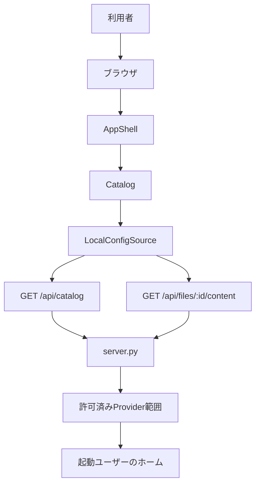

# 基本設計書（ローカルAIエージェント設定ビューア）
| 項目     | 内容                                  |
| :------- | :------------------------------------ |
| 文書番号 | ACV-BD-001                            |
| 版数     | Rev.2.0（ローカルサーバー方式へ更新） |
| 改訂日   | 2026-09-08                            |
| 作成者   | xzyozi                                |
## 1. 目的と対象範囲
agent-config-viewer は、`server.py` を起動したユーザーのホームディレクトリにある許可済みAIエージェント設定を、`127.0.0.1:8765` だけで提供する閲覧専用アプリケーションである。ブラウザによるフォルダ選択、任意パスの指定、編集、保存、外部送信、外部公開、認証連携は行わない。
| Provider | 許可済み範囲                                                                                                      |
| :------- | :---------------------------------------------------------------------------------------------------------------- |
| Kiro     | `.kiro/steering/**/*.md`、`.kiro/skills/**/SKILL.md`、`.kiro/knowledge/**/*.md`                                   |
| Claude   | `CLAUDE.md`、`.claude/settings.json`、`rules/**/*.md`、`skills/**/SKILL.md`、`commands/**/*.md`、`agents/**/*.md` |
| Gemini   | `GEMINI.md`、`.gemini/settings.json`、`commands/**/*.toml`、`skills/**/SKILL.md`                                  |
| Codex    | `.codex/config.toml`、`.codex/*.config.toml`                                                                      |
Codexの認証情報、履歴、ログ、および上表にないファイルは対象外とする。
## 2. アーキテクチャ

| Module              | 責務                                                                               |
| :------------------ | :--------------------------------------------------------------------------------- |
| `server.py`         | loopback待受、許可範囲の走査、File ID発行、本文取得時の再検証、静的ファイル配信    |
| `LocalConfigSource` | カタログ・本文APIのHTTP呼出し、レスポンス形式の検証                                |
| `Catalog`           | Provider表示順の統合、Provider結果と選択・プレビュー初期状態の生成                 |
| `AppShell`          | 走査、Provider・ファイル選択、非同期本文読込、古い読込結果の破棄                   |
| `BrowserView`       | アクセシブルなProviderタブ、一覧、プレーンテキストプレビュー、固定エラー文言の表示 |
## 3. 安全境界
- サーバーは `127.0.0.1` にだけbindし、外部ネットワークへ通信しない。
- 読取対象は起動時に解決したホーム配下の固定Provider rootと固定ホームファイルに限定する。
- 走査・本文読取の双方でシンボリックリンクまたはWindowsの再解析ポイントを除外する。
- カタログは実パスではなく推測困難な不透明File IDを返す。IDと許可rootの対応はプロセス内メモリだけに保持し、カタログ再生成時に置き換える。
- 本文取得時はIDの形式・存在、通常ファイル、許可root内、2MiB上限、UTF-8復号を再検証する。失敗時に本文、絶対パス、生例外を返さない。
- ブラウザは本文を `textContent` で `<pre>` に設定する。Markdownを含めHTMLとして解釈・実行しない。
## 4. 実行形態と将来拡張
Pythonが利用できる環境で `py server.py` を手動実行し、ブラウザで `http://127.0.0.1:8765/` を開く。CLIの `py cli.py list` は同じ許可済み範囲を本文非読取で確認する。Markdownの安全なHTMLレンダリング、検索、差分、編集、任意パス選択は初期実装の対象外とし、追加時は安全境界を別途設計する。
## 5. 改訂履歴
| 版数    | 改訂日     | 変更者 | 変更内容・変更理由                                                                     |
| :------ | :--------- | :----- | :------------------------------------------------------------------------------------- |
| Rev.1.0 | 2026-09-08 | xzyozi | 初版作成。                                                                             |
| Rev.1.1 | 2026-09-08 | xzyozi | 設計レビューを反映。                                                                   |
| Rev.2.0 | 2026-09-08 | xzyozi | フォルダ選択方式を廃止し、ローカルサーバー、Provider範囲、本文プレビューの実装へ追従。 |
