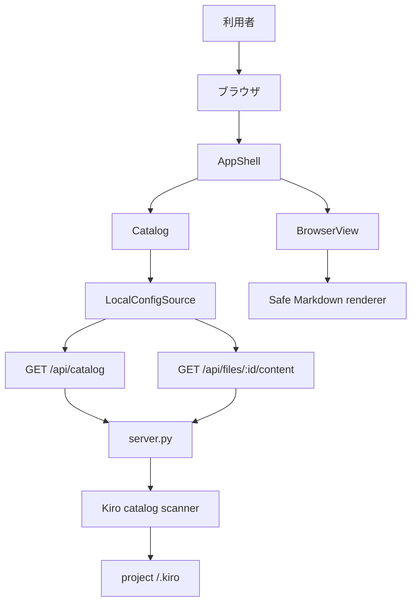

# 基本設計書（Kiro構成ビューア）
| 項目     | 内容                                    |
| :------- | :-------------------------------------- |
| 文書番号 | ACV-BD-001                              |
| 版数     | Rev.3.0（Kiro構成・Markdownビュー対応） |
| 改訂日   | 2026-10-01                              |
| 作成者   | xzyozi                                  |

## 1. 目的と対象範囲

agent-config-viewerは、`server.py`を起動したプロジェクトのルート直下にある`.kiro`を、`127.0.0.1:8765`だけで提供する閲覧アプリケーションである。`.kiro`配下を再帰的にツリー表示し、選択したファイルを閲覧する。ブラウザによる任意パス指定、通常ファイルの編集、作成、削除、改名、移動、外部送信は行わない。

| 対象 | 許可範囲                                                                      |
| :--- | :---------------------------------------------------------------------------- |
| Kiro | 現在のプロジェクトルート直下の`.kiro`配下。バックアップファイルとリンクは除外 |

バイナリはファイル情報だけを表示し、本文を解釈しない。既存のSkill bundleコピー機能はIssue #12の独立機能として保持する。

## 2. アーキテクチャ

```mermaid
flowchart TD
    User[利用者] --> Browser[ブラウザ]
    Browser --> AppShell[AppShell]
    AppShell --> Catalog[Catalog]
    Catalog --> Source[LocalConfigSource]
    Source --> CatalogApi[GET /api/catalog]
    Source --> ContentApi[GET /api/files/:id/content]
    CatalogApi --> Server[server.py]
    ContentApi --> Server
    Server --> Scanner[Kiro catalog scanner]
    Scanner --> ProjectKiro[project /.kiro]
    AppShell --> View[BrowserView]
    View --> Markdown[Safe Markdown renderer]
```

| Module                    | 責務                                                                                                  |
| :------------------------ | :---------------------------------------------------------------------------------------------------- |
| `server.py`               | loopback待受、プロジェクト`.kiro`への入口固定、API、File ID発行、本文取得時の再検証、静的ファイル配信 |
| `backend/kiro_catalog.py` | `.kiro`の再帰走査、バックアップ除外、リンク除外、ツリー生成、テキスト・バイナリ判定                   |
| `LocalConfigSource`       | カタログ・本文APIのHTTP呼出し、レスポンス形式と固定エラーコードの検証                                 |
| `Catalog`                 | Provider結果と選択・プレビュー初期状態の生成、本文取得の前提確認                                      |
| `AppShell`                | 走査、ファイル選択、非同期本文読込、Refresh、古い読込結果の破棄                                       |
| `BrowserView`             | Kiroツリー、ファイル情報、テキスト本文、Markdownプレビュー、固定エラー文言の表示                      |
| `markdown-renderer.js`    | `textContent`とDOM APIだけを使う安全なMarkdownブロック・インライン表示                                |

## 3. 安全境界

- サーバーは`127.0.0.1`にだけbindし、ブラウザから実パスを受け取らない。
- 読取対象ルートはプロセス起動時に決まるプロジェクトの`.kiro`だけである。
- 走査・本文読取の双方でシンボリックリンクとWindowsの再解析ポイントを除外する。
- バックアップファイルを固定パターンで除外し、対象範囲を明示する。
- カタログは実パスではなく推測困難な不透明File IDを返す。対応はプロセス内メモリだけに保持する。
- 本文取得時はID、リンク非該当、通常ファイル、許可root内、2MiB上限、バイナリ、UTF-8を再検証する。
- MarkdownはHTML文字列を解釈せず、DOM APIで要素とテキストノードを生成する。外部HTTPリンクには安全属性を付け、未許可スキームはリンク化しない。

## 4. 実行形態と将来拡張

Pythonが利用できる環境で`py server.py`を手動実行し、ブラウザで`http://127.0.0.1:8765/`を開く。CLIの`py cli.py list`は同じ`.kiro`走査を本文非読取で確認する。検索、差分、編集、任意パス選択、自動ファイル監視、表示性能最適化は初期実装の対象外とし、必要になった時点で別設計する。

## 5. 改訂履歴

| 版数    | 改訂日     | 変更者 | 変更内容・変更理由                                                       |
| :------ | :--------- | :----- | :----------------------------------------------------------------------- |
| Rev.1.0 | 2026-09-08 | xzyozi | 初版作成。                                                               |
| Rev.2.0 | 2026-09-08 | xzyozi | ローカルサーバー、Provider範囲、不透明ID本文取得へ更新。                 |
| Rev.3.0 | 2026-10-01 | xzyozi | Kiro専用の再帰ツリー、バックアップ・バイナリ制御、Markdownビューへ更新。 |
