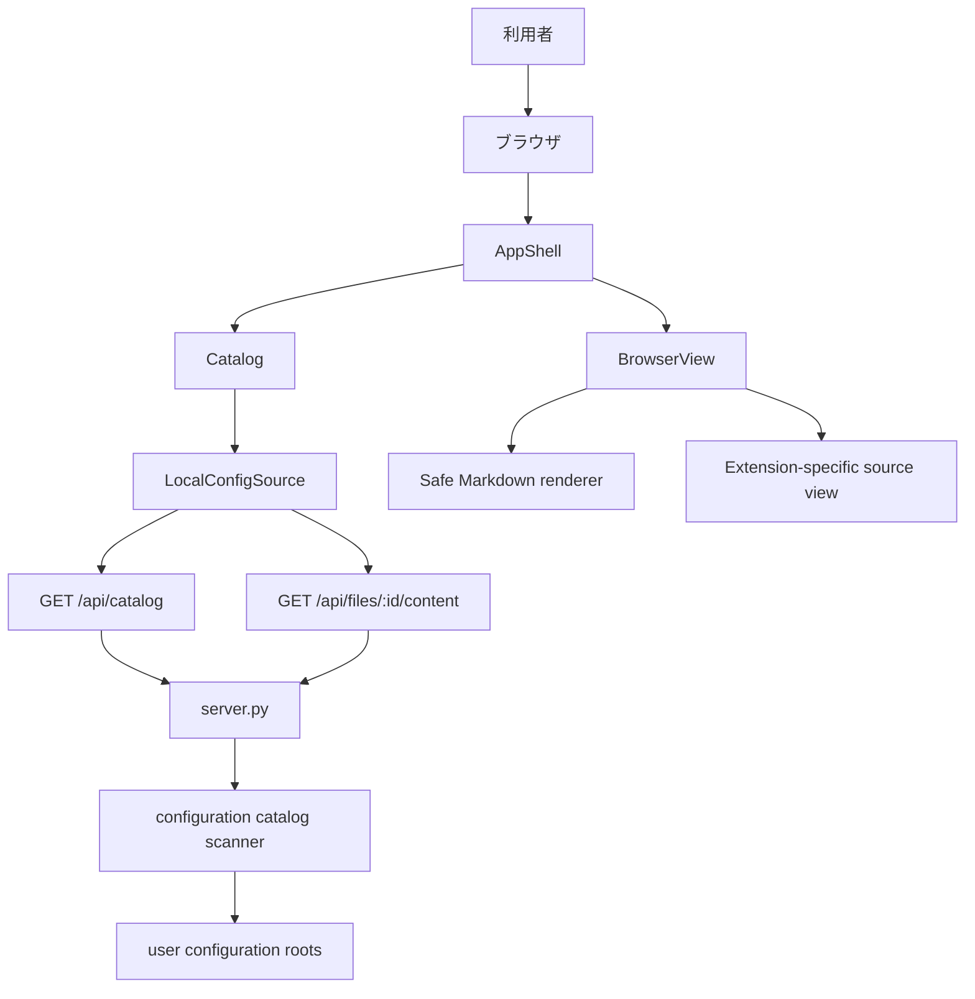

# 基本設計書（ローカルAIエージェント設定ビューア）
| 項目     | 内容                                      |
| :------- | :---------------------------------------- |
| 文書番号 | ACV-BD-001                                |
| 版数     | Rev.5.0（ユーザーroot限定・遅延本文読込） |
| 改訂日   | 2026-10-02                                |
| 作成者   | xzyozi                                    |

## 1. 目的と対象範囲

agent-config-viewerは、`server.py`を起動したユーザー環境の固定されたAIエージェント設定を、`127.0.0.1:8765`だけで提供する閲覧アプリケーションである。Providerタブごとにユーザーrootを表示し、ファイル選択時だけ本文を読み込む。プロジェクトroot、ブラウザによる任意パス指定、通常ファイルの編集、作成、削除、改名、移動、外部送信は行わない。

| Provider | ユーザーroot・固定ファイル |
| :------- | :------------------------- |
| Kiro     | `~/.kiro`                  |
| Claude   | `~/.claude`、`~/CLAUDE.md` |
| Gemini   | `~/.gemini`、`~/GEMINI.md` |
| Codex    | `~/.codex`、`~/AGENTS.md`  |

各rootは再帰走査する。バックアップ、ログ、セッション、一時領域、秘密情報を含む可能性が高いファイルは本文対象から除外または保護メタ情報だけを表示する。既知拡張子はカタログ生成時に本文を読まず、未知拡張子だけ短いサンプルで判定する。既存のSkill bundleコピー機能はIssue #12の独立機能として保持する。

## 2. アーキテクチャ

```mermaid
flowchart TD
    User[利用者] --> Browser[ブラウザ]
    Browser --> AppShell[AppShell]
    AppShell --> Catalog[Catalog]
    Catalog --> Source[LocalConfigSource]
    Source --> CatalogApi[GET /api/catalog]
    Source --> ContentApi[GET /api/files/:id/content]
    CatalogApi --> Server[server.py]
    ContentApi --> Server
    Server --> Scanner[configuration catalog scanner]
    Scanner --> UserRoots[user configuration roots]
    AppShell --> View[BrowserView]
    View --> Markdown[Safe Markdown renderer]
    View --> SourceView[Extension-specific source view]
```

| Module                    | 責務                                                                                     |
| :------------------------ | :--------------------------------------------------------------------------------------- |
| `server.py`               | loopback待受、固定Provider/user root宣言、API、File ID発行、本文再検証、静的ファイル配信 |
| `backend/kiro_catalog.py` | user rootの再帰走査、除外・保護・拡張子分類、ツリー生成                                  |
| `LocalConfigSource`       | カタログ・本文APIのHTTP呼出し、レスポンス形式と固定エラーコードの検証                    |
| `Catalog`                 | Provider表示順、選択・プレビュー初期状態、本文取得とSkill操作の前提確認                  |
| `AppShell`                | 走査、Provider・ファイル選択、遅延本文読込、Refresh、古い結果の破棄                      |
| `BrowserView`             | Providerタブ、rootツリー、ファイル情報、拡張子別View、固定エラーの表示                   |
| `markdown-renderer.js`    | DOM APIとテキストノードだけを使う安全なMarkdown表示                                      |

## 3. 安全境界と性能

- サーバーは`127.0.0.1`にだけbindし、ブラウザから実パスを受け取らない。
- 走査対象はコードで宣言したユーザーProvider rootと固定ホームファイルだけである。
- 走査・本文読取の双方でシンボリックリンクとWindows再解析ポイントを除外する。
- ログ、セッション、キャッシュ、一時ディレクトリ、バックアップファイルは対象外とする。
- `.env`、秘密鍵、token/password/secret/credentialを含む名前、既知の接続設定は保護メタ情報だけを表示する。
- カタログ生成では既知拡張子の内容を開かず、本文はファイル選択時に遅延読込する。
- File IDは実パスではなく推測困難な不透明値を返し、対応をプロセス内メモリだけに保持する。
- MarkdownはHTML文字列を解釈せず、DOM APIで要素とテキストノードを生成する。

## 4. 実行形態と将来拡張

Pythonが利用できる環境で`py server.py`を手動実行し、ブラウザで`http://127.0.0.1:8765/`を開く。CLIの`py cli.py list`は同じユーザーroot走査を本文非読取で確認する。検索、差分、編集、自動監視、任意root追加、表示性能最適化は初期実装の対象外とする。

## 5. 改訂履歴

| 版数    | 改訂日     | 変更者 | 変更内容                                                         |
| :------ | :--------- | :----- | :--------------------------------------------------------------- |
| Rev.1.0 | 2026-09-08 | xzyozi | 初版作成。                                                       |
| Rev.2.0 | 2026-09-08 | xzyozi | ローカルサーバー、Provider範囲、不透明ID本文取得へ更新。         |
| Rev.3.0 | 2026-10-01 | xzyozi | Kiro専用再帰カタログ、Markdownビューへ更新。                     |
| Rev.4.0 | 2026-10-02 | xzyozi | 4 Providerとプロジェクト/ユーザーrootへ拡張。                    |
| Rev.5.0 | 2026-10-02 | xzyozi | プロジェクトrootを除外し、ユーザーroot限定・遅延本文読込へ更新。 |
