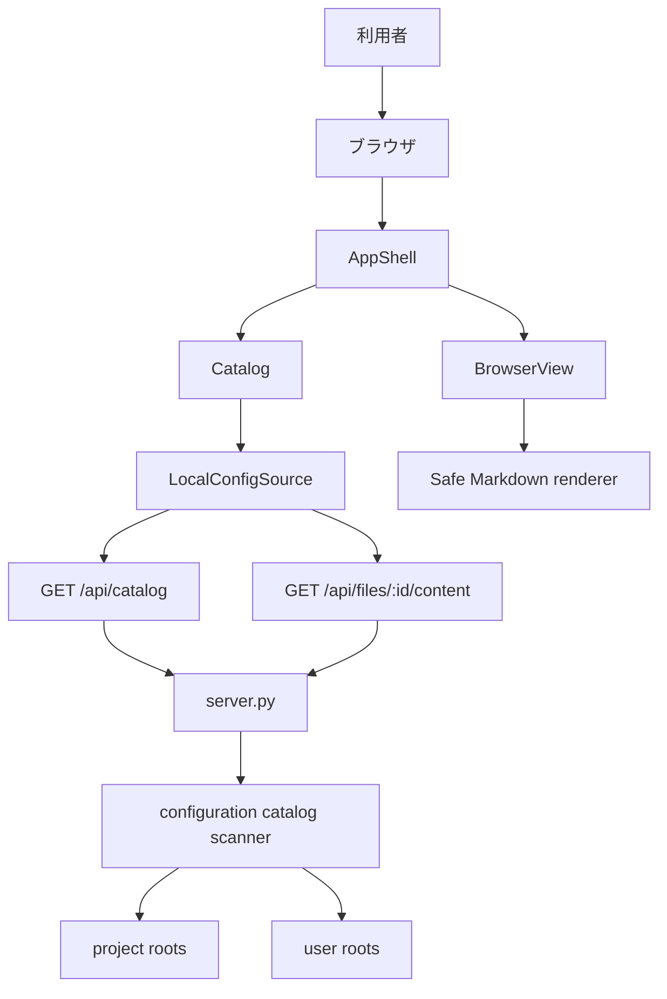

# 基本設計書（ローカルAIエージェント設定ビューア）
| 項目     | 内容                                  |
| :------- | :------------------------------------ |
| 文書番号 | ACV-BD-001                            |
| 版数     | Rev.4.0（複数Provider・複数root対応） |
| 改訂日   | 2026-10-02                            |
| 作成者   | xzyozi                                |

## 1. 目的と対象範囲

agent-config-viewerは、`server.py`を起動したプロジェクトとユーザー環境の固定されたAIエージェント設定を、`127.0.0.1:8765`だけで提供する閲覧アプリケーションである。Providerタブごとにプロジェクトrootとユーザーrootをまとめて表示し、ファイルを選択して本文を閲覧する。ブラウザによる任意パス指定、通常ファイルの編集、作成、削除、改名、移動、外部送信は行わない。

| Provider | プロジェクトroot       | ユーザーroot・固定ファイル |
| :------- | :--------------------- | :------------------------- |
| Kiro     | `.kiro`                | `~/.kiro`                  |
| Claude   | `.claude`、`CLAUDE.md` | `~/.claude`、`~/CLAUDE.md` |
| Gemini   | `.gemini`、`GEMINI.md` | `~/.gemini`、`~/GEMINI.md` |
| Codex    | `.codex`、`AGENTS.md`  | `~/.codex`、`~/AGENTS.md`  |

各rootは基本的に再帰走査する。バックアップ、ログ、セッション、一時領域、秘密情報を含む可能性が高いファイルは本文対象から除外または保護メタ情報だけを表示する。バイナリも本文を解釈しない。既存のSkill bundleコピー機能はIssue #12の独立機能として保持する。

## 2. アーキテクチャ

```mermaid
flowchart TD
    User[利用者] --> Browser[ブラウザ]
    Browser --> AppShell[AppShell]
    AppShell --> Catalog[Catalog]
    Catalog --> Source[LocalConfigSource]
    Source --> CatalogApi[GET /api/catalog]
    Source --> ContentApi[GET /api/files/:id/content]
    CatalogApi --> Server[server.py]
    ContentApi --> Server
    Server --> Scanner[configuration catalog scanner]
    Scanner --> ProjectRoots[project roots]
    Scanner --> UserRoots[user roots]
    AppShell --> View[BrowserView]
    View --> Markdown[Safe Markdown renderer]
```

| Module                    | 責務                                                                                    |
| :------------------------ | :-------------------------------------------------------------------------------------- |
| `server.py`               | loopback待受、固定Provider/root宣言、API、File ID発行、本文再検証、静的ファイル配信     |
| `backend/kiro_catalog.py` | 複数Provider/rootの再帰走査、バックアップ・運用領域除外、保護・バイナリ判定、ツリー生成 |
| `LocalConfigSource`       | カタログ・本文APIのHTTP呼出し、レスポンス形式と固定エラーコードの検証                   |
| `Catalog`                 | Provider表示順、選択・プレビュー初期状態、本文取得とSkill操作の前提確認                 |
| `AppShell`                | 走査、Provider・ファイル選択、非同期本文読込、Refresh、古い結果の破棄                   |
| `BrowserView`             | Providerタブ、複数rootツリー、ファイル情報、本文、Markdownプレビュー、固定エラーの表示  |
| `markdown-renderer.js`    | DOM APIとテキストノードだけを使う安全なMarkdown表示                                     |

## 3. 安全境界

- サーバーは`127.0.0.1`にだけbindし、ブラウザから実パスを受け取らない。
- 走査対象はコードで宣言したProviderのプロジェクトroot、ユーザーroot、固定ホームファイルだけである。
- 走査・本文読取の双方でシンボリックリンクとWindows再解析ポイントを除外する。
- ログ、セッション、キャッシュ、一時ディレクトリ、バックアップファイルは対象外とする。
- `.env`、秘密鍵、token/password/secret/credentialを含む名前、既知の接続設定は保護メタ情報だけを表示する。
- カタログは実パスではなく推測困難な不透明File IDを返し、対応をプロセス内メモリだけに保持する。
- 本文取得時はID、リンク非該当、通常ファイル、許可root内、サイズ、バイナリ、UTF-8を再検証する。
- MarkdownはHTML文字列を解釈せず、DOM APIで要素とテキストノードを生成する。外部HTTPリンクには安全属性を付け、未許可スキームはリンク化しない。

## 4. 実行形態と将来拡張

Pythonが利用できる環境で`py server.py`を手動実行し、ブラウザで`http://127.0.0.1:8765/`を開く。CLIの`py cli.py list`は同じ複数Provider/root走査を本文非読取で確認する。検索、差分、編集、自動ファイル監視、任意root追加、表示性能最適化は初期実装の対象外とし、必要になった時点で別設計する。

## 5. 改訂履歴

| 版数    | 改訂日     | 変更者 | 変更内容                                                                 |
| :------ | :--------- | :----- | :----------------------------------------------------------------------- |
| Rev.1.0 | 2026-09-08 | xzyozi | 初版作成。                                                               |
| Rev.2.0 | 2026-09-08 | xzyozi | ローカルサーバー、Provider範囲、不透明ID本文取得へ更新。                 |
| Rev.3.0 | 2026-10-01 | xzyozi | Kiro専用再帰カタログ、バックアップ・バイナリ制御、Markdownビューへ更新。 |
| Rev.4.0 | 2026-10-02 | xzyozi | Kiro以外を含む複数Providerとプロジェクト/ユーザーrootへ拡張。            |
