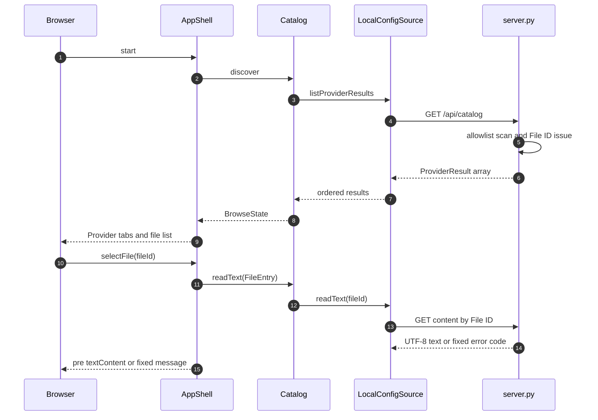

# 詳細設計書（閲覧フロー・Module制御仕様）
| 項目     | 内容                             |
| :------- | :------------------------------- |
| 文書番号 | ACV-DD-001                       |
| 版数     | Rev.2.0（ローカルAPI方式へ更新） |
| 改訂日   | 2026-09-08                       |
## 1. Providerカタログ
`server.py` の `PROVIDERS` がProvider ID、表示名、ホーム配下root、カテゴリを宣言する。カテゴリはカテゴリ名、`scope`（`provider` または `home`）、相対パス、許可パターンから成る。実装はKiro、Claude、Gemini、Codexを固定順で走査し、Provider rootがない場合も他Providerの結果を維持する。
| Provider | root      | 特記事項                                                         |
| :------- | :-------- | :--------------------------------------------------------------- |
| Kiro     | `.kiro`   | Steering、Skills、Knowledgeを対象                                |
| Claude   | `.claude` | ホーム直下の`CLAUDE.md`も対象。`settings.local.json`は対象外     |
| Gemini   | `.gemini` | ホーム直下の`GEMINI.md`も対象                                    |
| Codex    | `.codex`  | `config.toml`と`*.config.toml`のみ。認証情報・履歴・ログは対象外 |
## 2. HTTP Interface
| 操作         | URL                                | 成功応答                                     | 失敗応答                                                            |
| :----------- | :--------------------------------- | :------------------------------------------- | :------------------------------------------------------------------ |
| カタログ取得 | `GET /api/catalog`                 | `{"providerResults": ProviderResult[]}`      | HTTP 500相当のサーバー失敗                                          |
| 本文取得     | `GET /api/files/<file-id>/content` | `{"fileId": "...", "content": "UTF-8 text"}` | `too_large`: HTTP 413、その他: HTTP 404かつ`{"code":"read_failed"}` |
`LocalConfigSource` はカタログをページ表示中だけキャッシュし、API応答のProvider IDと本文のFile IDを検証する。URLには不透明File IDを `encodeURIComponent` して渡すだけで、相対・絶対パスを受け渡さない。
## 3. 処理フロー

`AppShell` はファイル選択時に`reading`状態を描画し、応答時点で選択File IDが変わっていれば古い結果を破棄する。Provider切替は選択済みファイルとプレビューを破棄する。
## 4. 読取ガードと失敗契約
`Catalog.readText` は `FileEntry.readable` が偽ならHTTP呼出しを行わない。サーバーは本文読取直前に、ID形式とメモリ上の対応、リンク非該当、通常ファイル、許可root内、2MiB以下を再検証し、最大2MiB+1バイトだけ読む。
| 分類                        | 表現                                        | UI動作                             |
| :-------------------------- | :------------------------------------------ | :--------------------------------- |
| Provider未検出              | `not_found`                                 | Providerタブ内の固定メッセージ     |
| Provider権限拒否            | `permission_denied`                         | Providerタブ内の固定メッセージ     |
| Provider一覧失敗            | `list_failed`                               | Providerタブ内の固定メッセージ     |
| サイズ超過                  | `unreadableReason=too_large` またはHTTP 413 | 本文を表示しない                   |
| 読取失敗・偽造ID・UTF-8失敗 | `read_failed`                               | 本文・絶対パス・例外詳細を出さない |
| カタログ取得失敗            | UIの`unexpected`                            | `server.py` の起動確認を案内       |
Markdown、JSON、TOMLを含む本文はすべてプレーンテキストで表示する。HTML変換、Markdown parser、DOMPurifyは未導入であり、将来追加時は別設計とする。
## 5. 検証方針
Python構文、空HOMEでのCLIカタログ、ES Module構文は既存のローカルビューアCIで検証する。本文APIはローカルの一時HOMEによるスモーク検証で、IDの非漏えい、UTF-8本文、サイズ超過、偽造ID拒否を確認する。Docs PRのMermaid図は既存のMermaid CIで検証する。
## 6. 改訂履歴
| 版数    | 改訂日     | 変更者 | 変更内容・変更理由                                                        |
| :------ | :--------- | :----- | :------------------------------------------------------------------------ |
| Rev.1.0 | 2026-09-08 | xzyozi | 初版作成。                                                                |
| Rev.1.1 | 2026-09-08 | xzyozi | 設計レビューを反映。                                                      |
| Rev.1.2 | 2026-09-08 | xzyozi | 実装前設計を確定。                                                        |
| Rev.2.0 | 2026-09-08 | xzyozi | ローカルAPI、Provider範囲、不透明ID本文取得、プレーンテキスト表示へ追従。 |
