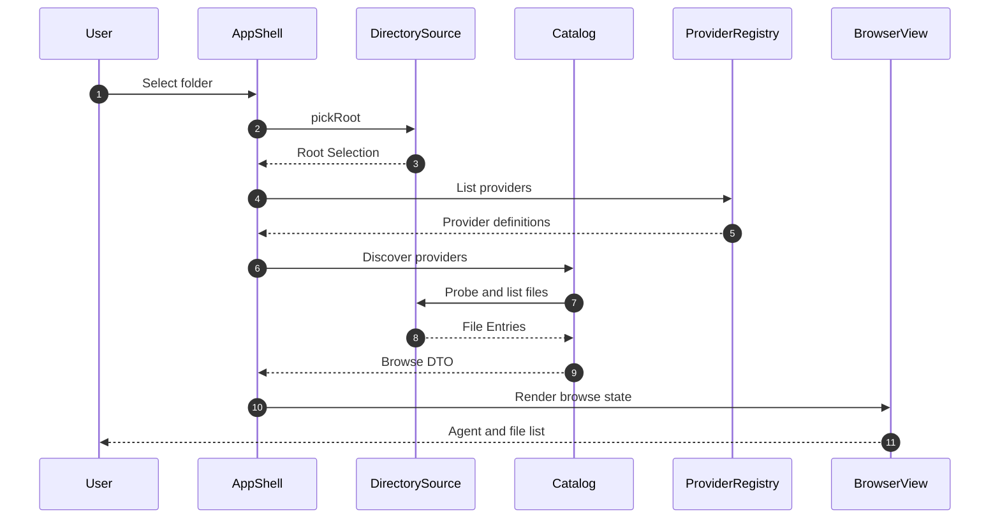
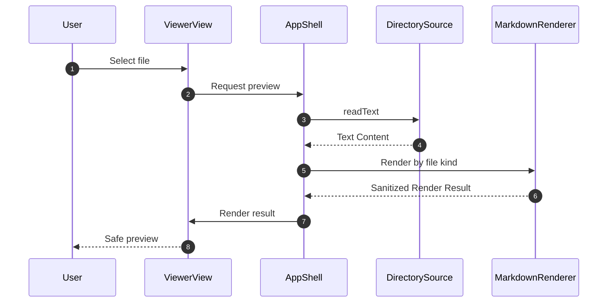

# 詳細設計書（閲覧フロー・Module制御仕様）
**フォルダ選択から安全なファイル表示までの制御仕様**

| 項目           | 内容                                     |
| :------------- | :--------------------------------------- |
| 文書番号       | ACV-DD-001                               |
| ドキュメント名 | agent-config-viewer 閲覧フロー詳細設計書 |
| 版数           | Rev.1.0（新規作成）                      |
| 改訂日         | 2026-09-08                               |
| 作成日         | 2026-09-08                               |
| 作成者         | xzyozi                                   |

## 1. 概要とSSOT境界
### 1.1 Moduleの目的
本書は、閲覧フローの呼び出し順序、Module Interface、状態遷移、エラー契約の正本とする。表示用DTOは本書、画面内状態のデータ構造はデータ構造仕様書を正本とする。

### 1.2 Provider ModuleのInterface
Providerはエージェント固有の構造差を吸収するModuleである。Providerが持つ情報は宣言的な設定だけとし、ファイルシステムの読込処理は行わない。

| フィールド            | 型     | 必須  | 制約・説明                                      |
| :-------------------- | :----- | :---: | :---------------------------------------------- |
| `id`                  | 文字列 | 必須  | 英小文字・数字・ハイフン。例: `kiro`            |
| `label`               | 文字列 | 必須  | UI表示名。例: `Kiro`                            |
| `rootDir`             | 文字列 | 必須  | 選択ルートからの相対ディレクトリ名。`..` を禁止 |
| `categories`          | 配列   | 必須  | 閲覧対象カテゴリの配列                          |
| `categories.name`     | 文字列 | 必須  | UI表示カテゴリ名                                |
| `categories.path`     | 文字列 | 必須  | Provider rootからの相対パス。`..` を禁止        |
| `categories.patterns` | 配列   | 必須  | 許可する拡張子・ファイル名パターン              |

初期Providerの対象例は以下とする。Claude・Geminiの具体的なパスは、対象ツールの実際の設定構造に合わせてProviderだけで更新できるようにする。

| Provider | rootDir   | 初期カテゴリ                          |
| :------- | :-------- | :------------------------------------ |
| Kiro     | `.kiro`   | Steering、Skills、Knowledge           |
| Claude   | `.claude` | Settings、Commands、Skills、Documents |
| Gemini   | `.gemini` | Settings、Commands、Skills、Documents |

### 1.3 DirectorySource Interface
| 操作        | 入力                     | 出力               | 事前条件                     | 事後条件                             |
| :---------- | :----------------------- | :----------------- | :--------------------------- | :----------------------------------- |
| `pickRoot`  | ユーザー操作             | Root Selection     | ブラウザが対応している       | 選択されたルートのみアクセス可能     |
| `probe`     | Root Selection、Provider | Provider Detection | ルート選択済み               | Provider rootの有無を返す            |
| `listFiles` | Root Selection、Provider | File Entry配列     | Provider検出済み             | 許可カテゴリ・許可パターンだけを返す |
| `readText`  | File Entry               | Text Content       | サイズ上限以下、テキスト形式 | 読取専用で本文を返す                 |
| `clear`     | なし                     | なし               | 任意                         | 画面内選択状態を破棄する             |

`DirectorySource` の呼び出し側は、File System Access APIまたはフォールバック方式を意識しない。ブラウザAPIの差異はAdapterのImplementationに隠蔽する。

## 2. 処理フロー
### 2.1 フォルダ選択・一覧表示シーケンス

### 2.2 ファイル表示シーケンス

### 2.3 画面遷移規則
| ルート             | 表示                             | 必須状態                   | 状態不足時の挙動             |
| :----------------- | :------------------------------- | :------------------------- | :--------------------------- |
| `#/browse`         | Provider・カテゴリ・ファイル一覧 | Root Selectionは任意       | 未選択ならフォルダ選択を促す |
| `#/view/<file-id>` | ファイル内容                     | Root Selection、File Entry | 一覧へ戻し、再選択を促す     |
| `#/error`          | 回復可能なエラー                 | Error DTO                  | エラー概要と復帰操作を表示   |

ブラウザの再読み込み、直接URL入力、またはタブ復元でRoot Selectionが失われた場合、アプリケーションはファイルを再読込しない。`#/browse` に遷移し、ユーザーへ再選択を求める。

## 3. MarkdownRenderer仕様
### 3.1 入力・出力
| 項目           | 内容                                                                |
| :------------- | :------------------------------------------------------------------ |
| 入力           | テキスト本文、ファイル種別、表示オプション                          |
| Markdown入力   | MarkdownパーサによりHTMLへ変換する                                  |
| Markdown安全化 | 生HTMLを無効化し、DOMPurifyでサニタイズする                         |
| 非Markdown入力 | HTMLへ変換せず、エスケープ済みテキストとしてコード表示する          |
| 出力           | 表示用HTMLまたは安全なテキスト表示DTO                               |
| 禁止事項       | 外部スクリプト実行、イベント属性、危険なURIスキーム、埋込コンテンツ |

### 3.2 Markdown表示の追加制約
- リンクは表示できるが、閲覧アプリケーションから自動的に開かない。
- 外部画像・埋込コンテンツは初期版では読み込まない。
- HTMLとして解釈される属性、`script`、イベントハンドラ、危険なURIスキームは削除する。
- 変換済みHTMLは、サニタイズ済みであることを示す内部DTOを経由してのみ表示領域へ渡す。

## 4. エラー処理・失敗契約
| エラー分類          | 判定基準                  |       再試行       | 終端状態           | 保持契約                     |
| :------------------ | :------------------------ | :----------------: | :----------------- | :--------------------------- |
| Browser Unsupported | 必要なAPIが利用不可       |        なし        | Fallback提示       | ファイル内容を保存しない     |
| User Cancelled      | フォルダ選択をキャンセル  |        任意        | Browse表示         | 既存表示を維持               |
| Provider Not Found  | Provider rootが存在しない |        なし        | 空状態表示         | 他Providerの結果は維持       |
| Permission Denied   | ブラウザの読取許可がない  | ユーザー操作時のみ | 再選択案内         | 権限昇格を自動実行しない     |
| File Too Large      | 規定サイズ超過            |        なし        | サイズ超過表示     | 本文を読まない               |
| Unsupported File    | 許可外形式・バイナリ      |        なし        | 非対応表示         | 本文を読まない               |
| Read Failed         | 読取途中の例外・削除      | ユーザー操作時のみ | 再読込案内         | 内容をキャッシュしない       |
| Render Failed       | パース・サニタイズ失敗    |        なし        | テキスト表示へ退避 | 元本文をHTMLとして挿入しない |

## 5. テスト・検証要件
- Providerごとに、許可カテゴリ外のファイルを一覧に含めないことを検証する。
- `DirectorySource` は `FakeDirectorySource` で正常系・権限拒否・欠損ファイル・巨大ファイルを検証できること。
- Markdown内のスクリプト、イベント属性、危険なリンクが表示DOMに残らないことを検証する。
- JSONなどの非MarkdownがHTMLとして実行・解釈されないことを検証する。
- Chromium系の標準Adapterと、`webkitdirectory` フォールバックの両方で最小閲覧フローを確認する。
- ドキュメントへMermaid図を保存する場合は、リポジトリ既存のMermaid CIで構文検証する。

## 6. 改訂履歴
| 版数    | 改訂日     | 変更者 | 変更内容・変更理由                                                     |
| :------ | :--------- | :----- | :--------------------------------------------------------------------- |
| Rev.1.0 | 2026-09-08 | xzyozi | 初版作成。閲覧フロー、Provider Interface、読取・表示の失敗契約を定義。 |
