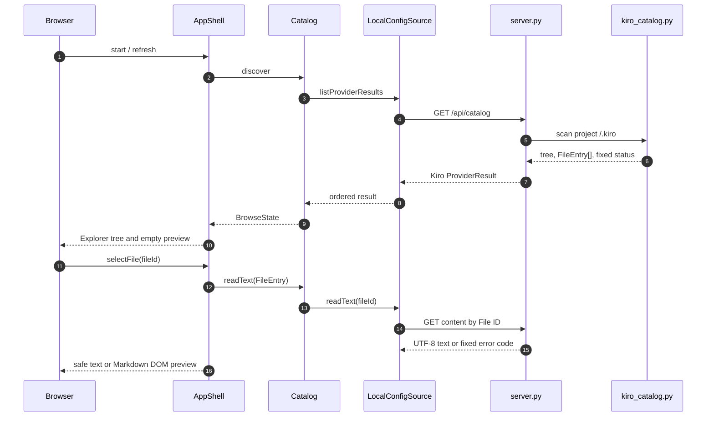

# 詳細設計書（Kiro構成閲覧フロー）
| 項目     | 内容                                      |
| :------- | :---------------------------------------- |
| 文書番号 | ACV-DD-001                                |
| 版数     | Rev.3.0（再帰ツリー・Markdownビュー対応） |
| 改訂日   | 2026-10-01                                |

## 1. Kiroカタログ

`server.py`は起動対象プロジェクトの`.kiro`をrootとして再帰走査する。ファイル名がバックアップ判定に一致するファイル、シンボリックリンク、Windows再解析ポイントは除外する。空ディレクトリを含むディレクトリノードと、ファイルIDを持つファイルノードを生成する。

Providerは当面`kiro`だけを返す。固定カテゴリの許可リストではなく、`.kiro`配下の通常ファイルを基本的にすべて列挙する。Skill bundleコピーに必要な`categoryName=Skills`は、相対パスの先頭ディレクトリから派生する。

## 2. HTTP Interface

| 操作         | URL                                        | 成功応答                                                            | 失敗応答                                                    |
| :----------- | :----------------------------------------- | :------------------------------------------------------------------ | :---------------------------------------------------------- |
| カタログ取得 | `GET /api/catalog`                         | `{"providerResults":[ProviderResult]}`。`tree`と`fileEntries`を含む | HTTP 500相当のサーバー失敗                                  |
| 本文取得     | `GET /api/files/<file-id>/content`         | `{"fileId":"...","content":"UTF-8 text"}`                           | `too_large`: HTTP 413、`binary`: HTTP 415、その他: HTTP 404 |
| 移行計画     | `GET /api/files/<file-id>/migration-plan`  | 既存Skill bundleのread-only計画                                     | 固定エラーコード                                            |
| Skillコピー  | `POST /api/files/<file-id>/migration-copy` | 既存Issue #12のコピー結果                                           | 固定エラーコード                                            |

`LocalConfigSource`はカタログを画面表示中だけキャッシュし、Refresh時に破棄する。URLには実パスではなく不透明File IDだけを渡す。

## 3. 処理フロー

```mermaid
sequenceDiagram
    autonumber
    participant Browser
    participant App as AppShell
    participant Catalog
    participant Source as LocalConfigSource
    participant Server as server.py
    participant Scanner as kiro_catalog.py
    Browser->>App: start / refresh
    App->>Catalog: discover
    Catalog->>Source: listProviderResults
    Source->>Server: GET /api/catalog
    Server->>Scanner: scan project /.kiro
    Scanner-->>Server: tree, FileEntry[], fixed status
    Server-->>Source: Kiro ProviderResult
    Source-->>Catalog: ordered result
    Catalog-->>App: BrowseState
    App-->>Browser: Explorer tree and empty preview
    Browser->>App: selectFile(fileId)
    App->>Catalog: readText(FileEntry)
    Catalog->>Source: readText(fileId)
    Source->>Server: GET content by File ID
    Server-->>Source: UTF-8 text or fixed error code
    App-->>Browser: safe text or Markdown DOM preview
```

`AppShell`はファイル選択時に`reading`状態を描画し、応答時点で選択File IDが変わっていれば古い結果を破棄する。Provider切替とRefreshでは選択・プレビューを破棄する。

## 4. 読取ガードと失敗契約

カタログ生成時のFileEntryで、バイナリは`kind=binary`、`readable=false`、`unreadableReason=binary`とする。UTF-8テキストでも2MiBを超える場合は`too_large`とする。本文取得直前にもID、リンク、通常ファイル、許可root内、サイズ、バイナリ、UTF-8を再検証する。

| 分類                     | 表現                | UI動作                             |
| :----------------------- | :------------------ | :--------------------------------- |
| `.kiro`未検出            | `not_found`         | Kiro root未検出メッセージ          |
| `.kiro`権限拒否          | `permission_denied` | 固定エラー文言                     |
| 一覧失敗                 | `list_failed`       | 固定エラー文言                     |
| バイナリ                 | `binary`            | ファイル情報だけを表示             |
| サイズ超過               | `too_large`         | 本文を表示しない                   |
| 読取失敗・偽造ID・リンク | `read_failed`       | 本文、絶対パス、生例外を表示しない |
| Markdown安全化           | DOM API / text node | HTML・スクリプトを実行しない       |

Markdownの相対リンクは`.kiro`内の既存FileEntryに解決できる場合だけアプリ内選択へ接続する。HTTP/HTTPSリンクは新しいタブと`noopener noreferrer`を付け、その他のスキームはリンク化しない。

## 5. 検証方針

Python構文とKiroカタログのスモーク検証をローカルで実施する。Browser E2Eは一時プロジェクトrootに作成したKiroフィクスチャだけを使い、Kiroのみのタブ、再帰ツリー、バックアップ除外、MarkdownのHTML非実行、バイナリ情報表示、サイズ超過、Skill bundleコピーを確認する。Windows固有の再解析ポイントは手動確認または専用テストで補完する。

## 6. 改訂履歴

| 版数    | 改訂日     | 変更者 | 変更内容                                                             |
| :------ | :--------- | :----- | :------------------------------------------------------------------- |
| Rev.1.0 | 2026-09-08 | xzyozi | 初版作成。                                                           |
| Rev.2.0 | 2026-09-08 | xzyozi | ローカルAPI、Provider範囲、不透明ID本文取得へ更新。                  |
| Rev.3.0 | 2026-10-01 | xzyozi | Kiro専用再帰カタログ、バイナリ制御、Markdown安全レンダリングへ更新。 |
