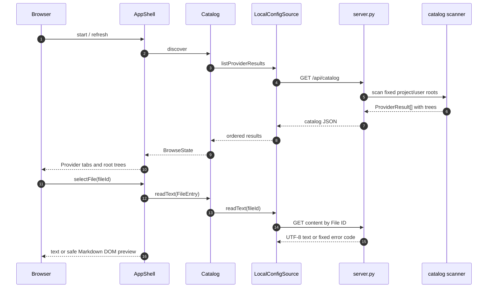

# 詳細設計書（複数Provider・root閲覧フロー）
| 項目     | 内容                                  |
| :------- | :------------------------------------ |
| 文書番号 | ACV-DD-001                            |
| 版数     | Rev.4.0（複数Provider・複数root対応） |
| 改訂日   | 2026-10-02                            |

## 1. Providerカタログ

`server.py`の`PROVIDERS`が、Provider ID、表示名、プロジェクトroot、ユーザーroot、固定ホームファイルを宣言する。`backend/kiro_catalog.py`は宣言されたrootだけを再帰走査し、Providerごとにrootノードを束ねたTreeNodeとフラットなFileEntry配列を生成する。

走査対象はKiro、Claude、Gemini、Codexである。ファイル名がバックアップ判定に一致するファイル、ログ・セッション・一時ディレクトリ、シンボリックリンク、Windows再解析ポイントは除外する。秘密情報の可能性が高いファイルはFileEntryを表示するが、本文取得を許可しない。

## 2. HTTP Interface

| 操作         | URL                                        | 成功応答                                                                          | 失敗応答                                                 |
| :----------- | :----------------------------------------- | :-------------------------------------------------------------------------------- | :------------------------------------------------------- |
| カタログ取得 | `GET /api/catalog`                         | `{"providerResults":[ProviderResult]}`。Providerごとに`tree`と`fileEntries`を含む | HTTP 500相当                                             |
| 本文取得     | `GET /api/files/<file-id>/content`         | `{"fileId":"...","content":"UTF-8 text"}`                                         | `too_large`: 413、`binary`/`sensitive`: 415、その他: 404 |
| 移行計画     | `GET /api/files/<file-id>/migration-plan`  | Kiro Skill bundleのread-only計画                                                  | 固定エラーコード                                         |
| Skillコピー  | `POST /api/files/<file-id>/migration-copy` | Issue #12のコピー結果                                                             | 固定エラーコード                                         |

File IDはrootをまたいで一意に発行する。APIは実パスを受け取らず、本文取得時にFile IDと許可rootの対応を再検証する。カタログはRefresh時に置き換える。

## 3. 処理フロー

```mermaid
sequenceDiagram
    autonumber
    participant Browser
    participant App as AppShell
    participant Catalog
    participant Source as LocalConfigSource
    participant Server as server.py
    participant Scanner as catalog scanner
    Browser->>App: start / refresh
    App->>Catalog: discover
    Catalog->>Source: listProviderResults
    Source->>Server: GET /api/catalog
    Server->>Scanner: scan fixed project/user roots
    Scanner-->>Server: ProviderResult[] with trees
    Server-->>Source: catalog JSON
    Source-->>Catalog: ordered results
    Catalog-->>App: BrowseState
    App-->>Browser: Provider tabs and root trees
    Browser->>App: selectFile(fileId)
    App->>Catalog: readText(FileEntry)
    Catalog->>Source: readText(fileId)
    Source->>Server: GET content by File ID
    Server-->>Source: UTF-8 text or fixed error code
    App-->>Browser: text or safe Markdown DOM preview
```

Provider切替とRefreshでは選択・プレビューを破棄する。ファイル選択の非同期応答は、選択File IDが一致する場合だけ画面状態へ反映する。

## 4. 読取ガードと失敗契約

カタログ生成時のFileEntryで、バイナリは`kind=binary`、秘密情報の可能性が高いファイルは`kind=sensitive`、どちらも`readable=false`とする。UTF-8テキストでも2MiBを超える場合は`too_large`とする。本文取得直前にもID、リンク、通常ファイル、許可root内、サイズ、バイナリ、UTF-8、保護判定を再検証する。

| 分類                     | 表現                | UI動作                             |
| :----------------------- | :------------------ | :--------------------------------- |
| Provider/root未検出      | `not_found`         | Provider内の固定メッセージ         |
| 権限拒否                 | `permission_denied` | 固定エラー文言                     |
| 一覧失敗                 | `list_failed`       | 固定エラー文言                     |
| バイナリ                 | `binary`            | ファイル情報だけを表示             |
| 保護対象                 | `sensitive`         | 保護済みファイル情報だけを表示     |
| サイズ超過               | `too_large`         | 本文を表示しない                   |
| 読取失敗・偽造ID・リンク | `read_failed`       | 本文、絶対パス、生例外を表示しない |

Markdownの相対リンクは現在表示中の同一rootに解決できる場合だけアプリ内選択へ接続する。HTTP/HTTPSリンクは新しいタブと`noopener noreferrer`を付け、その他のスキームはリンク化しない。ディレクトリTreeNodeは初期状態を閉じ、利用者が必要なrootとディレクトリだけを展開する。JSONは整形JSON、TOML/YAML/JavaScript/Python/CSS/HTML/Shellはソースコード、その他のテキストはプレーンテキストとして表示する。

## 5. 検証方針

Python構文、空のプロジェクト/ユーザーroot、複数Provider、ユーザーKiro、バックアップ・ログ除外、保護ファイル、バイナリ、本文取得をローカルスモークで確認する。Browser E2Eは一時的なプロジェクトrootとユーザーrootだけを使い、4 Providerのタブ、複数rootツリー、MarkdownのHTML非実行、Skill bundle操作を確認する。

## 6. 改訂履歴

| 版数    | 改訂日     | 変更者 | 変更内容                                                             |
| :------ | :--------- | :----- | :------------------------------------------------------------------- |
| Rev.1.0 | 2026-09-08 | xzyozi | 初版作成。                                                           |
| Rev.2.0 | 2026-09-08 | xzyozi | ローカルAPI、Provider範囲、不透明ID本文取得へ更新。                  |
| Rev.3.0 | 2026-10-01 | xzyozi | Kiro専用再帰カタログ、バイナリ制御、Markdown安全レンダリングへ更新。 |
| Rev.4.0 | 2026-10-02 | xzyozi | 複数Provider、プロジェクト/ユーザーroot、保護ファイル表示へ拡張。    |
