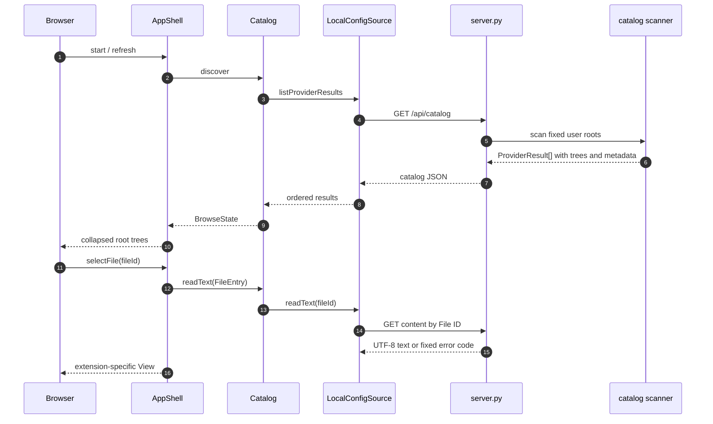

# 詳細設計書（ユーザーroot閲覧フロー）
| 項目     | 内容                                          |
| :------- | :-------------------------------------------- |
| 文書番号 | ACV-DD-001                                    |
| 版数     | Rev.5.0（ユーザーroot限定・軽量カタログ対応） |
| 改訂日   | 2026-10-02                                    |

## 1. Providerカタログ

`server.py`の`PROVIDERS`が、Provider ID、表示名、ユーザーroot、固定ホームファイルを宣言する。プロジェクトrootは定義しない。`backend/kiro_catalog.py`は宣言されたユーザーrootだけを再帰走査し、ProviderごとにTreeNodeとフラットなFileEntry配列を生成する。

カタログ生成では、既知の拡張子（Markdown、JSON、TOML、YAML、JavaScript、Python、CSS、HTML、Shell、Text）の本文を開かない。未知拡張子だけ512 bytesのサンプルを読み、バイナリ判定する。本文はファイル選択後の`GET /api/files/<file-id>/content`で遅延取得する。

## 2. HTTP Interface

| 操作             | URL                                            | 成功応答                                                      | 失敗応答                                                 |
| :--------------- | :--------------------------------------------- | :------------------------------------------------------------ | :------------------------------------------------------- |
| カタログ取得     | `GET /api/catalog`                             | `ProviderResult[]`。ユーザーrootの`tree`と`fileEntries`を含む | HTTP 500相当                                             |
| ディレクトリ展開 | `GET /api/directories/<directory-id>/children` | 指定ディレクトリ直下の`children`と`fileEntries`を含む         | 固定エラーコード                                         |
| 本文取得         | `GET /api/files/<file-id>/content`             | UTF-8本文                                                     | `too_large`: 413、`binary`/`sensitive`: 415、その他: 404 |
| 移行計画         | `GET /api/files/<file-id>/migration-plan`      | Kiro Skill bundleのread-only計画                              | 固定エラーコード                                         |
| Skillコピー      | `POST /api/files/<file-id>/migration-copy`     | Issue #12のコピー結果                                         | 固定エラーコード                                         |

File IDはProvider/rootをまたいで一意に発行する。APIは実パスを受け取らず、本文取得時にFile IDと許可rootの対応を再検証する。

## 3. 処理フロー

```mermaid
sequenceDiagram
    autonumber
    participant Browser
    participant App as AppShell
    participant Catalog
    participant Source as LocalConfigSource
    participant Server as server.py
    participant Scanner as catalog scanner
    Browser->>App: start / refresh
    App->>Catalog: discover
    Catalog->>Source: listProviderResults
    Source->>Server: GET /api/catalog
    Server->>Scanner: scan fixed user roots
    Scanner-->>Server: ProviderResult[] with trees and metadata
    Server-->>Source: catalog JSON
    Source-->>Catalog: ordered results
    Catalog-->>App: BrowseState
    App-->>Browser: collapsed root trees
    Browser->>App: selectFile(fileId)
    App->>Catalog: readText(FileEntry)
    Catalog->>Source: readText(fileId)
    Source->>Server: GET content by File ID
    Server-->>Source: UTF-8 text or fixed error code
    App-->>Browser: extension-specific View
```

Provider切替とRefreshでは選択・プレビューを破棄する。ファイル選択の非同期応答は、選択File IDが一致する場合だけ画面状態へ反映する。

## 4. 読取ガードとView契約

| `kind`                                                         | View                     | 本文取得 |
| :------------------------------------------------------------- | :----------------------- | :------- |
| `markdown`                                                     | 安全なMarkdownプレビュー | 遅延取得 |
| `json`                                                         | 整形JSONソースView       | 遅延取得 |
| `toml`、`yaml`、`javascript`、`python`、`css`、`html`、`shell` | ソースコードView         | 遅延取得 |
| `text`                                                         | プレーンテキストView     | 遅延取得 |
| `binary`                                                       | バイナリ情報View         | 不可     |
| `sensitive`                                                    | 保護済み情報View         | 不可     |

バックアップ、ログ、セッション、一時領域、シンボリックリンク、Windows再解析ポイントはカタログ対象外とする。2MiB超過、バイナリ、保護対象は本文を保持しない。Markdownの相対リンクは現在のユーザーroot内に解決できる場合だけアプリ内選択へ接続する。

## 5. 検証方針

Python構文、空ユーザーroot、複数Provider、ユーザーKiro、除外・保護・遅延本文取得をローカルスモークで確認する。Browser E2Eは一時ユーザーrootだけを使い、折りたたみ初期状態、拡張子別View、Markdown安全性、Skill bundle操作を確認する。

## 6. 改訂履歴

| 版数    | 改訂日     | 変更者 | 変更内容                                         |
| :------ | :--------- | :----- | :----------------------------------------------- |
| Rev.1.0 | 2026-09-08 | xzyozi | 初版作成。                                       |
| Rev.2.0 | 2026-09-08 | xzyozi | ローカルAPI、不透明ID本文取得へ更新。            |
| Rev.3.0 | 2026-10-01 | xzyozi | Kiro再帰カタログ、Markdown安全Viewへ更新。       |
| Rev.4.0 | 2026-10-02 | xzyozi | 複数Provider/rootへ拡張。                        |
| Rev.5.0 | 2026-10-02 | xzyozi | ユーザーroot限定、軽量分類、遅延本文取得へ更新。 |
