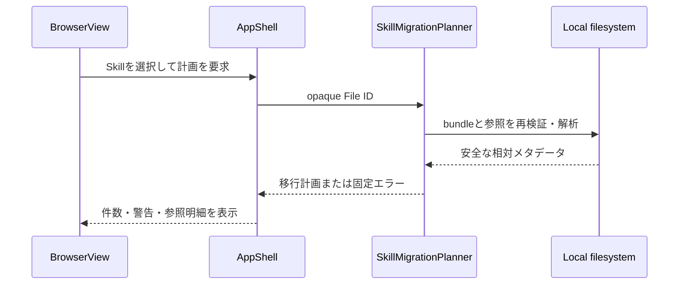

# Skill bundleパス移行詳細設計書
| 項目     | 内容                |
| :------- | :------------------ |
| 文書番号 | ACV-DD-002          |
| 版数     | Rev.1.0（新規作成） |
| 状態     | 提案                |

## 1. 結論と対象
パス変更は必須要件とする。ただし、`SKILL.md`を単独でコピー・移動してはならない。`.kiro/skills/<skill-name>/SKILL.md`を根に持つディレクトリ全体を**Skill bundle**として扱い、参照を解析してから計画・コピー・移動する。

初期実装は副作用のない移行計画の生成までとする。書込みは同一Provider内の非上書きコピーを先に導入し、移動はコピー、参照更新、整合性検証、復旧ジャーナル、実行直前再検証の完了後に別Phaseで導入する。

## 2. Bundleの定義と不変条件
- bundle rootはKiro Providerの`.kiro/skills`配下にあり、根の`SKILL.md`を持つ通常ディレクトリである。
- bundleはroot自身と、配下の通常ファイル・通常ディレクトリで構成する。シンボリックリンクとWindows再解析ポイントは走査・読取・コピーのいずれでも拒否する。
- `references/`、`scripts/`、`assets/`、補助READMEはbundleの通常エントリとして保全する。`SKILL.md`の記述だけを正本とみなさない。
- キャッシュ、`__pycache__`、`.git`、`.svn`、非UTF-8、バイナリ、秘密情報を含む可能性がある設定は、初期版の参照解析・自動更新対象から除外する。除外は警告として計画に残す。
- 宛先は同一Providerのskills rootからの一階層名だけとし、空文字、`.`、`..`、区切り文字、絶対パス、Provider横断を拒否する。既存宛先への上書きは禁止する。

## 3. 提案する深いModule
### 3.1 `SkillMigrationPlanner` Module
Interfaceは「カタログが発行したSkillのFile IDを受け、移行計画を返す」1操作だけとする。呼出し側はファイル列挙、リンク判定、UTF-8読取、相対パス正規化、参照分類、件数集計を知る必要がない。

- **Seam**: `server.py`のHTTPルートとplannerの間に置く。HTTP HandlerはIDだけを渡し、plannerはJSON可能な計画DTOか固定エラーを返す。
- **Depth / Leverage**: UI、将来のコピー実行、テストが同一の参照分類と安全判定を利用でき、個別の呼出し側でパス操作を実装しない。
- **Adapter**: 本番は`Path`と既存の`FILE_INDEX`を使うローカルfilesystem adapter、テストは一時HOMEのfixtureである。外部ストレージadapterは導入しない。

## 4. 参照解析と更新可否
解析対象はbundle内のUTF-8テキストだけである。各検出結果は参照元のbundle相対パス、行番号、種類、原文、解決結果、理由を保持する。任意の設定ファイル文字列を一括置換してはならない。

| 種類                   | 例                              | 自動更新候補 | 判定                                               |
| :--------------------- | :------------------------------ | :----------: | :------------------------------------------------- |
| Markdown相対リンク     | `[補足](references/guide.md)`   |      可      | 同一bundle内の通常ファイルに一意に解決する場合だけ |
| Kiro file参照          | `#[[file:references/guide.md]]` |      可      | 同上                                               |
| 明示的なbundle相対参照 | `` `scripts/check.py` ``        |      可      | `references/`、`scripts/`、`assets/`開始かつ同上   |
| URL・アンカー          | `https://…`、`#section`         |     不可     | externalとして保持                                 |
| 絶対・ホーム・環境依存 | `C:\…`、`/…`、`~/…`             |     不可     | externalとして保持                                 |
| bundle外参照           | `../other/README.md`            |     不可     | outside_bundleとして警告                           |
| 実体なし・曖昧な平文   | `references/missing.md`         |     不可     | missingまたはambiguousとして警告                   |

## 5. Read-only移行計画のInterface
`GET /api/files/<file-id>/migration-plan`は書込みを行わず、クエリ、リクエスト本文、任意パスを受け取らない。既存の本文取得と同じく、現在のカタログで発行された不透明IDを入力とし、実パスをクライアントへ返さない。

成功時は次のDTOを返す。`bundlePath`と参照元はProvider rootからの相対パスだけとし、本文・OS例外・絶対パスを含めない。

```json
{
  "fileId": "opaque-id",
  "bundlePath": ".kiro/skills/example",
  "snapshotDigest": "sha256-hex",
  "summary": {"detected": 3, "updatable": 2, "notUpdated": 1, "unresolved": 1},
  "references": [{"sourcePath": "SKILL.md", "line": 4, "kind": "markdown", "target": "references/guide.md", "status": "updatable", "resolvedPath": "references/guide.md", "reason": null}],
  "warnings": [{"path": "settings.ini", "reason": "excluded_kind"}]
}
```

`file-id`が失効・偽造・非Skill・リンク・許可root外・読取不可の場合は、HTTP 404と`{"code":"read_failed"}`を返す。計画内に更新不能な参照があっても計画全体を失敗にせず、個別結果として返す。

## 6. 将来のコピー・移動契約
コピー実行は、表示済み計画のdigest、同一Provider内の許可済み宛先名、明示確認を必須とする。実行直前にsource、bundle配下、宛先親の全エントリを再解析し、リンク・再解析ポイント、競合、bundle外逸脱、計画の陳腐化を検出したら書込み前に中止する。

コピーは専用ステージングに作成し、各ファイルのコピー・参照更新・UTF-8再読込・参照再解析を完了してから宛先へ確定する。失敗時はステージングだけを除去し、元bundleを変更しない。移動はこの成功済みコピーを前提とし、確定後の再検証と復旧ジャーナルが成功した場合に限り元bundleを削除する。書込み結果・ジャーナルは本文、絶対パス、資格情報を含めない。

## 7. 処理フロー


## 8. テスト・受入条件
- fixtureには`SKILL.md`、`references/`、`scripts/`、`assets/`、正常リンク、Kiro file参照、欠損参照、bundle外参照、URL、絶対パス、非UTF-8、リンク／再解析ポイントを含める。
- 計画取得後もファイル内容、配置、更新日時を変更しない。
- 偽造ID、失効ID、非Skill ID、リンク、2MiB超過、UTF-8失敗を固定エラーで拒否する。
- 正常な同一bundle参照だけが`updatable`となり、それ以外は更新候補にしない。
- 将来の書込みPhaseでは、競合拒否、計画陳腐化拒否、失敗時の元bundle保全、コピー後の参照再解析、移動キャンセルを追加検証する。

## 9. 改訂履歴
| 版数    | 改訂日     | 変更者 | 変更内容                                                   |
| :------ | :--------- | :----- | :--------------------------------------------------------- |
| Rev.1.0 | 2026-09-11 | xzyozi | Skill bundleを単位とする必須パス移行の詳細設計を新規作成。 |
