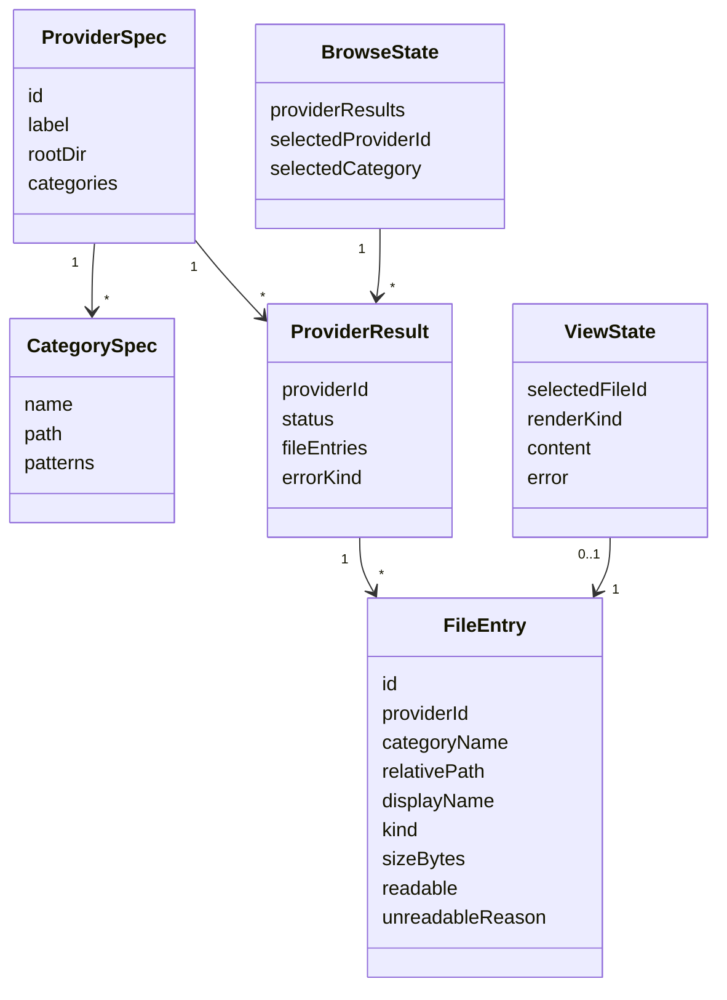

# データ構造・状態設計書（画面内データ・非永続化仕様）
**閲覧対象のファイル内容を保存しないためのデータ構造・状態定義**

| 項目           | 内容                                       |
| :------------- | :----------------------------------------- |
| 文書番号       | ACV-DS-001                                 |
| ドキュメント名 | agent-config-viewer 画面内データ構造仕様書 |
| 版数           | Rev.1.1（レビュー反映）                    |
| 改訂日         | 2026-09-08                                 |
| 作成日         | 2026-09-08                                 |
| 作成者         | xzyozi                                     |

## 1. 概要とデータ管理方針
### 1.1 管理対象データの目的
本システムは閲覧専用であり、設定ファイルの内容・パス・Directory Handleを永続化しない。管理対象は画面表示中だけ存在するメモリ上のDTOである。

### 1.2 DAO・永続化方針
- 初期版にDAO、データベース、ローカルストレージ、IndexedDBは設けない。
- 閲覧対象ファイルの本文を保存・複製・送信しない。
- RouterのURLにはファイルパス・内容を含めず、画面内でのみ有効な不透明なFile Entry IDだけを使用する。
- 画面再読込時には選択状態を破棄し、ユーザーにフォルダ再選択を求める。
- Provider定義はアプリケーションに同梱する静的な設定であり、実行中に変更・保存しない。

## 2. データモデル
### 2.1 関係図

### 2.2 ProviderSpec
| フィールド   | データ型         | 必須性 | 制約                                         |
| :----------- | :--------------- | :----: | :------------------------------------------- |
| `id`         | 文字列           |  必須  | 一意。英小文字・数字・ハイフンのみ           |
| `label`      | 文字列           |  必須  | 表示用名称                                   |
| `rootDir`    | 文字列           |  必須  | 単一相対ディレクトリ名。`..`、絶対パスを禁止 |
| `categories` | CategorySpec配列 |  必須  | 1件以上                                      |
| `enabled`    | 真偽値           |  必須  | 初期値は真                                   |

### 2.3 CategorySpec
| フィールド     | データ型   | 必須性 | 制約                               |
| :------------- | :--------- | :----: | :--------------------------------- |
| `name`         | 文字列     |  必須  | Provider内で一意                   |
| `path`         | 文字列     |  必須  | Provider rootからの相対パス        |
| `patterns`     | 文字列配列 |  必須  | 許可するファイル名・拡張子パターン |
| `displayOrder` | 数値       |  必須  | 昇順表示用の非負整数               |

### 2.4 FileEntry
| フィールド         | データ型       | 必須性 | 制約                                                                                                  |
| :----------------- | :------------- | :----: | :---------------------------------------------------------------------------------------------------- |
| `id`               | 文字列         |  必須  | 画面内で一意の不透明ID。URLへ実パスを出さない                                                         |
| `providerId`       | 文字列         |  必須  | 登録済みProviderを参照                                                                                |
| `categoryName`     | 文字列         |  必須  | Provider内の登録済みCategoryを参照                                                                    |
| `relativePath`     | 文字列         |  必須  | 選択ルートからの相対パス。`..` を含まない                                                             |
| `displayName`      | 文字列         |  必須  | UI表示名                                                                                              |
| `kind`             | 列挙値         |  必須  | `markdown`、`json`、`toml`、`yaml`、`text`                                                            |
| `sizeBytes`        | 数値           |  必須  | 0以上。読込上限判定に利用                                                                             |
| `readable`         | 真偽値         |  必須  | 真の場合だけ `readText` を呼び出せる                                                                  |
| `unreadableReason` | 列挙値または空 |  必須  | `readable` が偽の場合は `too_large`、`unsupported_kind`、`permission_denied` のいずれか。真の場合は空 |

### 2.5 ProviderResult
| フィールド    | データ型       | 必須性 | 制約                                                                    |
| :------------ | :------------- | :----: | :---------------------------------------------------------------------- |
| `providerId`  | 文字列         |  必須  | 登録済みProviderを参照                                                  |
| `status`      | 列挙値         |  必須  | `ok`、`not_found`、`permission_denied`、`list_failed`                   |
| `fileEntries` | FileEntry配列  |  必須  | `status` が `ok` の場合に対象ファイルを保持。その他は空配列             |
| `errorKind`   | 列挙値または空 |  必須  | `status` が `ok` 以外の場合のUI表示用分類。例外本文・絶対パスを含めない |

### 2.6 BrowseStateおよびViewState
`BrowseState` はProviderごとの `ProviderResult` を保持する。Provider単位の失敗は一覧画面内で表示し、全Providerの結果を破棄しない。トップレベルの `error` 状態は、Root Selectionの喪失などアプリケーション全体を継続できない失敗だけに使用する。

| 状態          | 主なフィールド               | 用途                                         |
| :------------ | :--------------------------- | :------------------------------------------- |
| `idle`        | なし                         | 起動直後                                     |
| `pickingRoot` | 操作中フラグ                 | フォルダ選択ダイアログの起動中               |
| `scanning`    | Root Selection、Provider一覧 | Provider検出・ファイル走査中                 |
| `browsing`    | BrowseState                  | Providerごとの成功・部分失敗を含む一覧表示   |
| `reading`     | selectedFileId               | 読取可能なファイル本文を読込中               |
| `rendered`    | ViewState                    | 安全な内容表示が完了                         |
| `error`       | Error DTO                    | アプリケーション全体の回復可能なエラーを表示 |

## 3. データ生命周期
### 3.1 生命周期規則
1. ユーザーがフォルダを選択する。
2. DirectorySourceが一時的なRoot Selectionを返す。
3. CatalogがProviderSpecを参照し、ProviderごとのProviderResultと閲覧可能なFileEntryをメモリ上に生成する。
4. ユーザーがFileEntryを選ぶと、本文を一時的に読み込み、Render Resultを生成する。
5. フォルダ再選択、一覧への復帰、画面再読込、タブ終了のいずれかで選択状態と本文を破棄する。

### 3.2 互換性方針
- ProviderSpecへのカテゴリ追加は後方互換な変更とする。
- `FileEntry.kind` へ新しい種別を追加する場合、未知の種別は安全なテキスト表示へ退避する。
- 既存Providerのパス変更はProvider Module内で閉じ、CatalogやView Moduleにパス知識を漏らさない。

## 4. データ保護方針
- ファイル本文は画面表示のためだけにメモリへ保持し、永続ストレージへ保存しない。
- 例外メッセージは、必要最小限の種類・相対表示名だけをUIへ渡す。絶対パスや本文は表示しない。
- テレメトリ、アクセス解析、外部ログ送信は実装しない。
- 将来、検索インデックスや閲覧履歴を追加する場合は、保存範囲・保持期間・消去操作を定義するデータ構造仕様書を別途作成する。

## 5. 改訂履歴
| 版数    | 改訂日     | 変更者 | 変更内容・変更理由                                                                       |
| :------ | :--------- | :----- | :--------------------------------------------------------------------------------------- |
| Rev.1.0 | 2026-09-08 | xzyozi | 初版作成。画面内DTO、状態遷移、非永続化方針を定義。                                      |
| Rev.1.1 | 2026-09-08 | xzyozi | 設計レビューを反映。ProviderResultとunreadableReasonを追加し、部分失敗を表現可能にした。 |