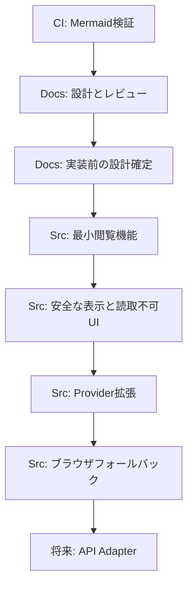

# 実装タスクフロー

| 項目           | 内容                                 |
| :------------- | :----------------------------------- |
| 文書番号       | ACV-PM-001                           |
| ドキュメント名 | agent-config-viewer 実装タスクフロー |
| 版数           | Rev.1.1（T-DOC-002完了）             |
| 改訂日         | 2026-09-08                           |
| 作成日         | 2026-09-08                           |
| 作成者         | xzyozi                               |

## 1. 目的と運用方針

本書は、設計文書、CI基盤、アプリケーション実装を別タスク・別PRとして管理するための実行順序を定義する。各PRは単一の目的を持ち、設計の未確定事項を実装PRへ持ち込まない。

| 区分 | 目的                           | 初期スコープ                             |
| :--- | :----------------------------- | :--------------------------------------- |
| Docs | 要件・設計・レビューの合意形成 | 設計書、レビュー、タスクフロー           |
| CI   | 文書品質の自動検証             | Mermaid構文検証のみ                      |
| Src  | ローカル閲覧ビューアの機能提供 | HTML、ES Modules、ローカルvendor、テスト |

## 2. CIの現行スコープ

現行CIはMermaid Markdown検証だけを対象とする。lint、単体テスト、ブラウザテスト、依存関係監査などは本タスクフローの初期スコープに含めず、実装の安定後に別途判断する。

| CI項目               | 状態   | 方針                                         |
| :------------------- | :----- | :------------------------------------------- |
| Mermaid Markdown検証 | 有効   | `docs/**/*.md` 内のMermaidブロックを検証する |
| JavaScript lint      | 未導入 | 本タスクでは追加しない                       |
| 単体テスト           | 未導入 | 本タスクでは追加しない                       |
| ブラウザテスト       | 未導入 | 本タスクでは追加しない                       |
| 依存関係監査         | 未導入 | 本タスクでは追加しない                       |

## 3. タスク依存関係

## 4. タスク一覧

### T-DOC-001: 設計・レビュー文書の維持

| 項目     | 内容                                                         |
| :------- | :----------------------------------------------------------- |
| 区分     | Docs                                                         |
| 成果物   | BD-001、DD-001、DS-001、RV-001、本書                         |
| 内容     | ローカル完結・閲覧専用の設計と、レビュー指摘の記録を維持する |
| 完了条件 | 文書間の参照先、版数、改訂履歴、Mermaid図が整合する          |
| PR範囲   | `docs/` 配下の文書のみ                                       |

### T-DOC-002: 実装前の設計確定

| 項目     | 内容                                                                                                                                           |
| :------- | :--------------------------------------------------------------------------------------------------------------------------------------------- |
| 区分     | Docs                                                                                                                                           |
| 前提     | T-DOC-001                                                                                                                                      |
| 状態     | 完了（2026-09-08）                                                                                                                             |
| 内容     | Providerごとの実パス・許可パターン、Error DTO、Root Selection喪失時の遷移、DDとDSのフィールド正本を確定する                                    |
| 決定     | Kiro、Claude、Geminiの初期対象をProvider root内の確認済みパスへ限定する。Root Selection喪失時はError DTOではなくBrowse Stateの再選択案内とする |
| 完了条件 | `Catalog`、`ProviderResult`、`FileEntry`、`Error DTO` を実装者が解釈なく実装できる                                                             |
| PR範囲   | 設計書・レビュー文書のみ                                                                                                                       |

### T-CI-001: Mermaid検証の維持

| 項目     | 内容                                                         |
| :------- | :----------------------------------------------------------- |
| 区分     | CI                                                           |
| 成果物   | Mermaid検証workflow、検証スクリプト、運用文書                |
| 内容     | `docs/**/*.md` のMermaidブロックをGitHub Actionsで検証する   |
| 完了条件 | Mermaidを含むDocs PRで検証が実行され、構文エラーを検出できる |
| 非対象   | JavaScript lint、単体テスト、ブラウザテスト、依存関係監査    |
| PR範囲   | `.github/` とMermaid運用文書のみ                             |

### T-SRC-001: 最小閲覧機能

| 項目     | 内容                                                                                                             |
| :------- | :--------------------------------------------------------------------------------------------------------------- |
| 区分     | Src                                                                                                              |
| 前提     | T-DOC-002                                                                                                        |
| 内容     | 単一HTML、AppShell、Router、Catalog、Kiro Provider、File System Access APIによるフォルダ選択と一覧表示を実装する |
| 完了条件 | ユーザー選択フォルダの `.kiro` を検出し、許可対象のファイル一覧を表示できる                                      |
| PR範囲   | `index.html` と `src/` の最小実装。CI設定は変更しない                                                            |

### T-SRC-002: 安全なコンテンツ表示

| 項目     | 内容                                                                                       |
| :------- | :----------------------------------------------------------------------------------------- |
| 区分     | Src                                                                                        |
| 前提     | T-SRC-001                                                                                  |
| 内容     | MarkdownRenderer、ローカルvendor、DOMPurify、サイズ上限、`unreadableReason` のUIを実装する |
| 完了条件 | Markdownを安全に表示し、巨大・非対応・権限拒否の理由を本文読取前に表示できる               |
| PR範囲   | `src/`、`vendor/`、ライセンス情報。CI設定は変更しない                                      |

### T-SRC-003: Provider拡張

| 項目     | 内容                                                                     |
| :------- | :----------------------------------------------------------------------- |
| 区分     | Src                                                                      |
| 前提     | T-SRC-002                                                                |
| 内容     | Claude Provider、Gemini Provider、ProviderResultの部分失敗表示を実装する |
| 完了条件 | 一部Providerの未検出・読取失敗時にも、他Providerの閲覧結果を維持できる   |
| PR範囲   | `src/providers/`、関連するView Moduleのみ                                |

### T-SRC-004: ブラウザフォールバック

| 項目     | 内容                                                                                           |
| :------- | :--------------------------------------------------------------------------------------------- |
| 区分     | Src                                                                                            |
| 前提     | T-SRC-003                                                                                      |
| 内容     | `webkitdirectory` を利用するWebkitDirectory Adapterと、非対応ブラウザ向けの案内を実装する      |
| 完了条件 | File System Access APIが利用できない場合も、対応環境ではフォルダ一括選択による閲覧が可能である |
| PR範囲   | `src/sources/`、利用方法文書のみ                                                               |

### T-FUTURE-001: API Adapter

| 項目         | 内容                                                                            |
| :----------- | :------------------------------------------------------------------------------ |
| 区分         | 将来検討                                                                        |
| 前提         | T-SRC-004完了後に別途要件化                                                     |
| 内容         | ローカルDirectorySourceと同等の閲覧Interfaceを満たすAPI Adapterを設計・実装する |
| 完了条件     | 認証、認可、通信失敗、秘密情報の扱い、外部送信の同意を別設計で確定する          |
| 初期スコープ | 対象外                                                                          |

## 5. PR分割ルール

- Docs PRは設計・レビュー・タスク文書だけを変更し、`src/`、`vendor/`、CI設定を含めない。
- CI PRはworkflow、検証スクリプト、CI運用文書だけを変更し、アプリケーション機能を含めない。
- Src PRは一つの利用者価値を単位とし、設計上の未確定事項を解決する変更を混在させない。
- Mermaid図を追加・更新するDocs PRは、現行のMermaid CIを品質ゲートとする。
- CI追加は、実装が安定し必要性・利用ツール・依存固定方針が合意された時点で、別のCI PRとして扱う。

## 6. 改訂履歴

| 版数    | 改訂日     | 変更者 | 変更内容・変更理由                                                                                 |
| :------ | :--------- | :----- | :------------------------------------------------------------------------------------------------- |
| Rev.1.0 | 2026-09-08 | xzyozi | 新規作成。Docs、CI、Srcを分離した実装タスクフローと、Mermaid検証だけを対象にする現行CI方針を定義。 |
| Rev.1.1 | 2026-09-08 | xzyozi | T-DOC-002を完了。初期Providerの対象範囲、Error DTO、Root Selection喪失時の遷移を確定。             |